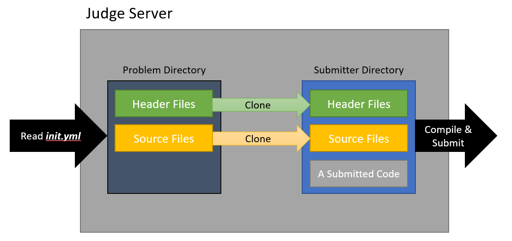

# Multiple Files Grader

## Introduction
* 제출자 소스 파일 **1개**, 채점자 소스 파일은 **여러 개**를 사용하는 방식입니다.
* 채점자는 3rd party 라이브러리 제공 권한을 가집니다.
* 제출자는 읽기 전용의 3rd party 라이브러리를 사용한 코드를 제출할 수 있습니다.
* 3rd party 라이브러리를 제출자 코드에 포함할 필요가 없고, 채점자는 솔루션 코드에만 집중할 수 있습니다.

## How it works


1. `init.yml` 를 읽어서 `files` 키가 존재하면 `MultipleFilesGrader`를 실행합니다.
2. **Problem Directory** 의 헤더/소스 코드를 **Submitter Directory** 로 복사합니다.
3. 컴파일러로 실행 파일을 만들고, 채점을 진행합니다.

## Example File

[multiplefilestest.zip](https://github.com/jubin-park/JOTA-dmoj-judge-server/files/6824426/multiplefilestest.zip)

**Problem Code**: `multiplefilestest`


## Problem Directory Tree
```
.
+-- lib
|   +-- subtractor.c
|   +-- subtractor.h
+-- adder.c
+-- adder.h
+-- data.zip
+-- init.yml
+-- list.h
```

## init.yml
```yml
archive: data.zip
files: {
  headers: {adder.h, lib/subtractor.h, list.h},
  sources: {adder.c, lib/subtractor.c}
}
test_cases:
- {in: siggrade.1.in, out: siggrade.1.out, point: 50}
- {in: siggrade.2.in, out: siggrade.2.out, point: 10}
```

## adder.h
```C
#ifndef _ADDER_H_
#define _ADDER_H_
int add(int a, int b);
#endif /* _ADDER_H_ */
```

## adder.c
```C
#include "adder.h"

int add(int a, int b)
{
    return a + b;
}
```

## lib/subtractor.h
```C
#ifndef _SUBTRACTOR_H_
#define _SUBTRACTOR_H_
int subtract(int a, int b);
#endif /* _SUBTRACTOR_H_ */
```

## lib/subtractor.c
```C
#include "subtractor.h"

int subtract(int a, int b)
{
    return a - b;
}
```

## list.h (코드 생략)

## Submitter Code
```C
#include <stdio.h>

#include "list.h"
#include "adder.h"
#include "lib/subtractor.h"

int main()
{
    LIST_HEAD(program_list);

    int a;
    int b;

    scanf("%d%d", &a, &b);

    printf("%d\n", add(a, b));
    printf("%d\n", subtract(a, b));

    return 0;
}
```